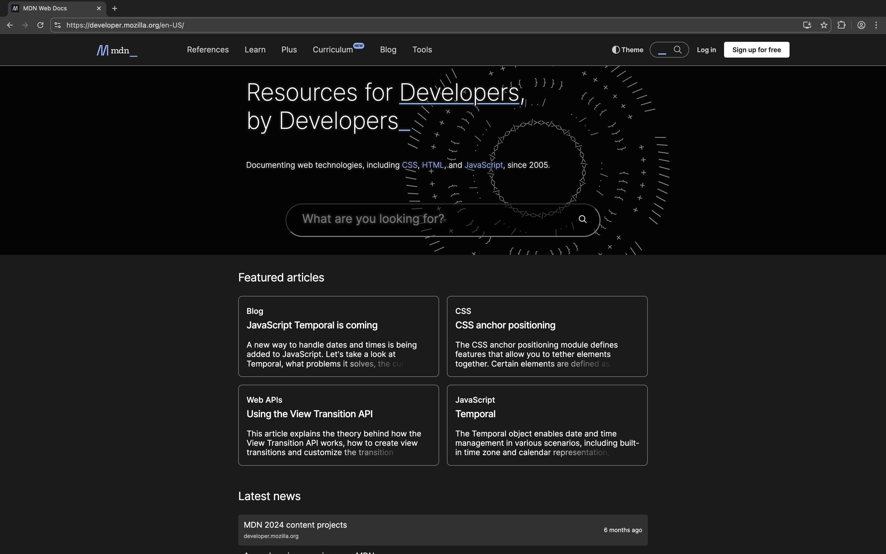

In no particular order...

## 1. cobalt.tools

[Visit cobalt](https://cobalt.tools) - [View source code](https://github.com/imputnet/cobalt) - [Check out its developers](https://imput.net)

Awesome free and open-source media downloader.

YouTube have blocked downloads using Cobalt lately. A big L, in my opinion... Luckily there are other community instances like [cobalt.canine.tools](https://cobalt.canine.tools) that seem to work more reliably.

## 2. freemediaheckyeah (FMHY)

[Visit FMHY](https://fmhy.net) - [View documentation source](https://github.com/fmhy/edit)

Valuable resources from knowledge relating to downloading media very, very legally, to tools for work/school, computing in general, etc.

## 3. Mozilla MDN Web Docs

[Visit MDN](https://developer.mozilla.org/en-US/) - [View documentation source](https://github.com/mdn/content) - [Check out its developers](https://mozilla.org)

Despite Mozilla's shortcomings over the past few years, the MDN Web Docs have remained one of the most valuable resources for me during my journey into HTML & CSS.

## Thanks for reading

I will probably update this with some more websites in the near future!